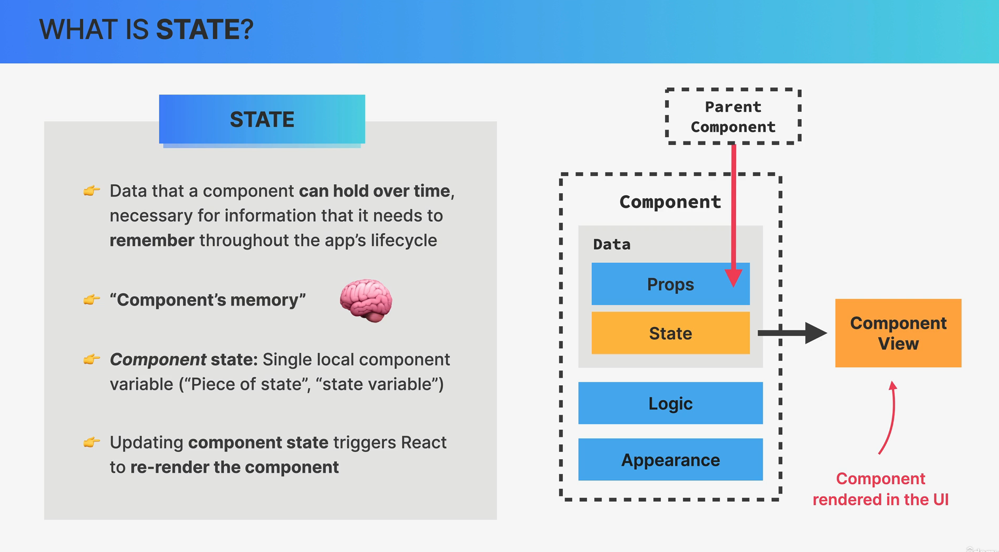
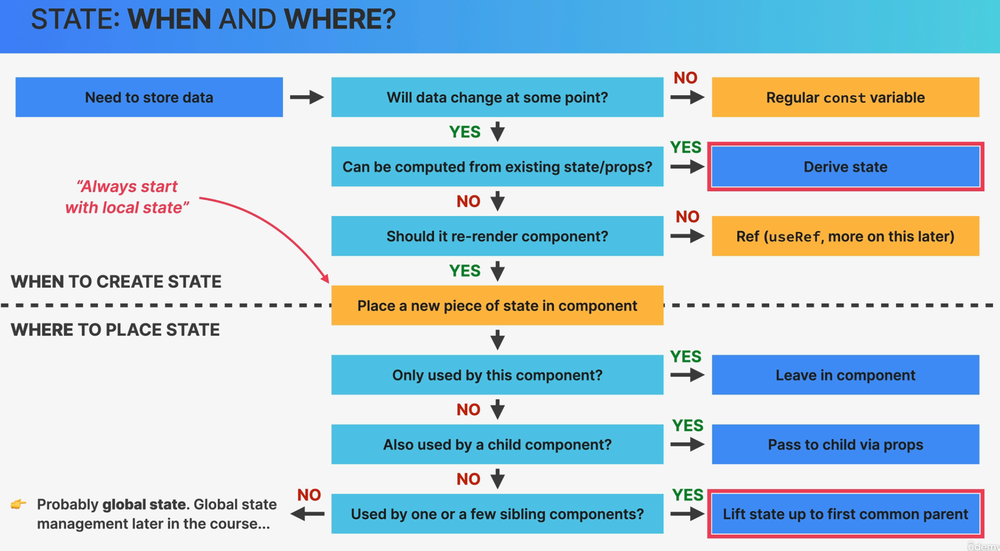

# Ultimate React Course by Jonas Schmedtmann

## Section 3: A First Look at React

### Pure React

- We learn how to use React without any build tool or package manager. We use the CDN links to React and Babel. We need to include 3 scripts in our HTML file:
  - React
  - ReactDOM
  - Babel
- We use the `type="text/babel"` attribute in our script tag to tell the browser that we are using JSX.
- We use the `ReactDOM.createRoot()` method to render our React app. This method is the new way of rendering React apps. The old way is to use the `ReactDOM.render()` method. The `createRoot()` method is more efficient and it is the recommended way of rendering React apps. We pass the `createRoot()` method the container element where we want to render our React app.

[Try React Locally](https://react.dev/learn/installation)

<details>
<summary>
HTML page from `react.dev` to try React locally
</summary>

```html
<!DOCTYPE html>
<html>
  <head>
    <meta charset="UTF-8" />
    <title>Hello World</title>
    <script src="https://unpkg.com/react@18/umd/react.development.js"></script>
    <script src="https://unpkg.com/react-dom@18/umd/react-dom.development.js"></script>

    <!-- Don't use this in production: -->
    <script src="https://unpkg.com/@babel/standalone/babel.min.js"></script>

  </head>
  <body>
    <div id="root"></div>
    <script type="text/babel">

      function MyApp() {
        return <h1>Hello, world!</h1>;
      }

      const container = document.getElementById('root');
      const root = ReactDOM.createRoot(container);
      root.render(<MyApp />);

    </script>


  </body>
</html>

```

</details>

<details>
<summary>Code Explanation</summary>

```javascript
<script>
      function App() {
        return React.createElement("header", null, "Hello React Header");
      }

      const root = ReactDOM.createRoot(document.getElementById("root"));
      root.render(React.createElement(App));
</script>
```

`root.render(React.createElement(App));`is doing two things:

- `React.createElement(App)` is creating an instance of the App component. This is the equivalent of writing `<App />` in JSX.

- `root.render(...)` is instructing React to render the instance of the `App` component into the root DOM node of your application.

</details>

> Pure React HTML

```html
<!DOCTYPE html>
<html lang="en">
  <head>
    <meta charset="UTF-8" />
    <meta name="viewport" content="width=device-width, initial-scale=1.0" />
    <title>12-12-23 01-Pure React</title>
  </head>
  <body>
    <div id="root"></div>
    <script src="https://unpkg.com/react@18/umd/react.development.js"></script>
    <script src="https://unpkg.com/react-dom@18/umd/react-dom.development.js"></script>
    <script>
      function App() {
        return React.createElement("h3", null, "Hello React Header");
      }

      const root = ReactDOM.createRoot(document.getElementById("root"));
      root.render(React.createElement(App));
    </script>
  </body>
</html>

```

#### React useState and useEffect First Look

- We use the `React.useState()` hook to create a state variable. The `useState()` hook returns an array with two elements. The first element is the state variable and the second element is a function that we can use to update the state variable. We pass the initial value of the state variable to the `useState()` hook as an argument.
- `React.useEffect(...)` is a hook that lets you perform side effects in function components. Side effects could be data fetching, subscriptions, or manually changing the DOM. In this case, the side effect is setting up an interval.

```html
<!DOCTYPE html>
<html lang="en">
  <head>
    <meta charset="UTF-8" />
    <meta name="viewport" content="width=device-width, initial-scale=1.0" />
    <title>12-12-23 01-Pure React</title>
  </head>
  <body>
    <div id="root"></div>
    <script src="https://unpkg.com/react@18/umd/react.development.js"></script>
    <script src="https://unpkg.com/react-dom@18/umd/react-dom.development.js"></script>
    <script>
      function App() {
        const [time, setTime] = React.useState(new Date().toLocaleTimeString());

        React.useEffect(function () {
          setInterval(function() {
            setTime(new Date().toLocaleTimeString())
          }, 1000);
        }, [])

        return React.createElement("h3", null, `Hello React! It is ${time}`);
      }

      const root = ReactDOM.createRoot(document.getElementById("root"));
      root.render(React.createElement(App));
    </script>
  </body>
</html>

```

- The first argument to useEffect is a function where you put the side effect code. This function will run after the render is committed to the screen. The function sets up an interval that runs every 1000 milliseconds (or 1 second). On each interval, it updates the state with the current time string.

- The second argument is an array of dependencies. If any of the dependencies change, the side effect function will run again. If you pass an empty array, the side effect function will only run once after the initial render.

- The side effect of this example is setting up an interval. The interval will run every 1000 milliseconds and update the state with the current time string. The side effect function will only run once after the initial render because we passed an empty array as the second argument. It is considered a side effect because it involves interacting with the outside world(in this case, the system's clock) and it changes the state of the component, which can lead to a re-render.

- Here's the process:

  1. The component renders for the first time.
  2. After the first render, the useEffect hook runs because it's called in the component.
  3. Inside the useEffect, setInterval is called. This sets up a timer that calls its callback function every 1000 milliseconds.
  4. Every 1000 milliseconds, the callback function to setInterval is called. This function updates the state with the current time string by calling setTime(new Date().toLocaleTimeString()).
  5. Updating the state causes the component to re-render, and the new time is displayed.
  6. Even though the component re-renders, the useEffect does not run again because its dependency array is empty. This means the setInterval is not set up again, and the existing interval continues to run.

- So, while the useEffect is only called once, the setInterval it sets up continues to run and update the state every second.

#### React Documentation

- [React Documentation](https://react.dev/learn)

### Setting Up a New React Project

#### The Two Options For Setting Up a New React Project

- We can use the `create-react-app` package to set up a new React project. This is the recommended way of setting up a new React project. It is the easiest way to get started with React. It sets up a React project with all the necessary dependencies and build tools. It also sets up a development server that automatically reloads the browser when you make changes to your code. It is the best way to get started with React. Use for tutorials or experiments. Do not use for real-world projects.
- We can also use `Vite` to set up a new React project. `Vite` is a new build tool that is very fast. It is a good alternative to `create-react-app`. It is a modern build tool that contains a template for setting up a React project. But we need to manually set up ESLint and others. It is extremely fast and it is good for real-world projects.

#### What about React Frameworks?

- `Next.js` and `Remix` are popular React Frameworks.

#### Create React App

Steps to set up a new React project with `create-react-app`:

1. use `npx create-react-app@5 my-app` to create a new React project. Replace `my-app` with the name of your project. `pizza-menu` is the name of the project in this example.
2. use `cd my-app` to change into the project directory.
3. use `npm start` to start the development server.
4. use `npm run build` to build the project for production.
5. use `npm run test` to run the tests.

The project is the same as the one we created using npm init and installing the dependencies manually. The only difference is that we didn't have to install the dependencies manually. The `create-react-app` package installed the dependencies for us. When checking the node_modules folder, we can see that `react` and `react-dom` are installed as dependencies. We included them using script tags in the previous example.

## Section 4 Review of Essential JavaScript for React

### Destructing Objects and Arrays

- Object destructing is a way to extract properties from an object and assign them to variables. We use the curly braces to destructure an object. We put the property names inside the curly braces. We can also rename the variables when destructuring an object. We use the colon to rename a variable. We put the new variable name before the colon and the old variable name after the colon. We can also set default values for the variables when destructuring an object. We use the equal sign to set a default value. We put the default value after the equal sign. `const {title, author} = book;` is the same as `const title = book.title; const author = book.author;`

- Array destructing is a way to extract items from an array and assign them to variables. We use the square brackets to destructure an array. We put the variable names inside the square brackets. We can also rename the variables when destructuring an array. We use the colon to rename a variable. We put the new variable name before the colon and the old variable name after the colon. We can also set default values for the variables when destructuring an array. We use the equal sign to set a default value. We put the default value after the equal sign. `const [first, second] = numbers;` is the same as `const first = numbers[0]; const second = numbers[1];`

### Rest and Spread Operators

- The rest operator is used to get the remaining items in an array. We use the rest operator to get the remaining items in an array when destructuring an array. We use the rest operator to get the remaining items in an array when destructuring an array. `const [first, second, ...others] = numbers;` is the same as `const first = numbers[0]; const second = numbers[1]; const others = numbers.slice(2);`

- The spread operator is used to spread the items in an array. We use the spread operator to spread the items in an array when destructuring an array. `const newGenre = [...genres, "Thriller"];` will create a new array with the items in the genres array and the string "Thriller". `const newGenre = ["Thriller", ...genres];` will create a new array with the string "Thriller" and the items in the genres array. `const updatedBook = {...book, title: "New Title"};` will create a new object with the properties in the book object and the title property set to "New Title". \

- We can also use the spread operator to overwrite an existing property. `const updatedBook = {...book, movieReleaseDate: "2021-12-31", pages: 1210};` will create a new object with the properties in the book object and the movieReleaseDate property set to "2021-12-31". The pages property will also be overwritten and updated to 1210.

### Template Literals

- Template literals are a way to create strings. We use the backtick `` to create a template literal. We can use the dollar sign and curly braces to insert a variable into a template literal. We can also use the dollar sign and curly braces to insert an expression into a template literal. We can also use the dollar sign and curly braces to insert a function call into a template literal. We can also use the dollar sign and curly braces to insert a ternary operator into a template literal.

```javascript

const summary = `${title} by ${author} has ${pages} pages.`;
const summary = `${title} by ${author} has ${pages} pages. ${pages > 500 ? "That's a long book!" : "That's a short book!"}`;

const summary = `${title}, a ${pages}-page long book, was written by ${author} and published in ${publicationDate.split("-")[0]}`;

```

### Arrow Functions

- Arrow functions are a way to create functions.
- The basic syntax is `const functionName = (parameters) => {function body}`.
- It has several special properties
  - It does not have its own `this` keyword. It inherit the `this` keyword from the the surrounding scope, which can be useful when working with object methods or event handlers.
  - No `arguments` object. We can use the rest operator(...args) to achieve the same functionality.
  - Cannot be used as constructors with the `new` keyword because they do not have the `prototype` property.

> `this` example

```javascript
function RegularFunction() {
  this.value = 1;
  setTimeout(function() {
    console.log(this.value); // undefined, because 'this' inside the function refers to the global object
  }, 100);
}

function ArrowFunction() {
  this.value = 1;
  setTimeout(() => {
    console.log(this.value); // 1, because 'this' inside the arrow function refers to the enclosing ArrowFunction object
  }, 100);
}

new RegularFunction(); // logs 'undefined'
new ArrowFunction(); // logs '1'
```

> arguments example

```javascript
function regularFunction() {
  console.log(arguments[0]); // logs 'hello'
}

const arrowFunction = (...args) => {
  console.log(args[0]); // logs 'hello'
};

regularFunction('hello', 'world');
arrowFunction('hello', 'world');
```

### Short-Circuiting and Logical Operators

- Short-circuiting is a way to write conditional statements in a shorter way.
- We use the `&&` operator to short-circuit the first falsy value. When the first value is falsy, it will return false without evaluating the second value. When the first value is truthy, it will return the second value.
- We use the `||` operator to short-circuit the first truthy value. When the first value is truthy, it will return true without evaluating the second value. When the first value is falsy, it will return the second value.
- falsy values: `false`, `0`, `""`, `null`, `undefined`, `NaN`.
- There may be some issue with `0` and `""` as falsy values. For example, we want to show the number of reviews of a book, when there is no review, we want to show "No reviews". But if the book has 0 reviews, we will show "No reviews" instead of "0 reviews." `const reviews = book.reviews || "No reviews";` will not work because `0` is a falsy value. `const reviews = book.reviews || book.reviews === 0 ? "No reviews" : book.reviews;` will work. But it is not a good solution.
- We can use the `??` operator to solve this problem. `const reviews = book.reviews ?? "No reviews";` will work. The `??` operator will return the second value if the first value is `null` or `undefined`. It will not return the second value if the first value is `0` or `""`.

```javascript

const b1 = true && "Hello"; // "Hello"
const b2 = false && "Hello"; // false

const b3 = false || "Hello"; // "Hello"
const b4 = true || "Hello"; // true

const reviews = book.reviews || "No reviews"; // wrong way
const reviews = book.reviews || book.reviews === 0 ? "No reviews" : book.reviews;
const reviews = book.reviews ?? "No reviews";

```

### Optional Chaining

- Optional chaining is a way to access properties of an object when the object may be null or undefined.
- We use the question mark `?` to access properties of an object when the object may be null or undefined. `const pages = book?.details?.pages;` will return `undefined` if `book` or `book.details` is `null` or `undefined`.

```javascript

function getTotalReviewCount(book) {
  const goodreads = book.reviews.goodreads?.reviewCount ?? 0;
  const libraryThing = book.reviews.libraryThing?.reviewCount ?? 0;
  return goodreads + libraryThing;

}

```

- JavaScript won't read the rest of the expression if the first part is `null` or `undefined`.
- We use `??` to set a default value for the expression. `const goodreads = book.reviews.goodreads?.reviewCount ?? 0;` will return `0` if `book.reviews.goodreads?.reviewCount` is `null` or `undefined`.

### The Array map Method

- The `map()` method creates a new array with the results of calling a function for every array element.
- The `map()` method calls the provided function once for each element in an array, in order.
- The `map()` method does not execute the function for array elements without values.
- The `map()` method does not change the original array.

```javascript

```

### The Array filter Method

### The Array reduce Method

### The Array sort Method

### Working with Immutable Arrays

### Asynchronous JavaScript: Promises

### Asynchronous JavaScript: Async/Await

## Section 6: States, Events, and Forms: Interactive Components

### What is State?



- state is used by a component to hold its own data, instead of getting data from its parent component via `props` . The data can also hold over time and persist between renders. Also, `state` can help make our app interactive and can change the UI of the component as a result of some action / events.
- state is data that a component can hold over time, necessary for information that it needs to remember throughout the app’s lifecycle
- It is the component’s memory.
- An example of state can be a notification count, the text of an input field, active tab in a tabs component, the content of a shopping cart
- state variable / piece of state: a single variable in a component(component state).
- The term state is more about the entire state of the component which can contain many variables.

### Rendering Items List

- `map()` is used to render a list of items. It takes an array and returns a new array with the same number of items. It is used to transform an array into another array. It does not mutate the original array. It is a pure function.

```javascript
function PackingList() {
  return (
    <div className="list">
      <ul>
        {initialItems.map((item) => (
          // the key prop needs to be on the direct children of the array being mapped over
          <Item key={item.id} item={item} />
        ))}
      </ul>
    </div>
  );
}

function Item({ item }) {
  return <li>{item.description}</li>;
}
```

- `map()` takes a callback function as an argument. The callback function takes the current item as an argument and returns a new item. The new item is added to the new array. The new array is returned by `map()`.
- React uses the key prop to identify each child in the list and determine whether the specific node has changed, been added, or removed. It's important to note that the `key` prop needs to be on the direct children of the array being mapped over. The direct children of the array are the `Item` components, not the `li` elements. Therefore, the key prop should be on the Item component, not the `li` element.

#### Conditionally Rendering Item: Adding styles

```javascript
function Item({ item }) {
  return (
    <li>
      <span style={item.packed ? { textDecoration: "line-through" } : {}}>
        {item.quantity} {item.description}
      </span>
      <button>❌</button>
    </li>
  );
}
```

- We conditionally add a line-through style to the span element if the item is packed. We use the ternary operator to conditionally add the style. We use an empty object to remove the style.

### Building a Form and Handling Submissions

#### Create 1-20 Options in a Select Element

```javascript
<select name="" id="">
      {Array.from({ length: 20 }, (_, i) => i + 1).map((num) => (
        <option value={num} key={num}>
          {num}
        </option>
      ))}
</select>
```

- `Array.from({ length: 20 }, (_, i) => i + 1)` creates an array with 20 items. The items are numbers from 1 to 20. The first argument is an object with a length property. The second argument is a callback function. The callback function takes the current item and the current index as arguments. The callback function returns a new item. The new item is added to the new array. `_` is the current item. `i` is the current index.
- We use the `map()` method to render the options and each option is assigned a value from 1 to 20, we need to add a key prop to each option so that React can keep track of each option.

#### Handling Form Submission

- We need to prevent the default behavior of the HTML form element, which is to reload the page when the form is submitted(When click the submit button or press enter). We use the `e.preventDefault()` method to prevent the default behavior of the HTML form element.
- We can keep track of the event by either using the `onSubmit` event handler on the form element or the `onClick` event handler on the submit button. We use the `onSubmit` event handler on the form element because it is more accessible. The `onSubmit` event handler is triggered when the form is submitted, either by clicking th
- Note that we cannot use `{handleSubmit()}` because it will be called immediately when the component is rendered. We need to use `{handleSubmit}` instead, so that React will call the function when the form is submitted. We can also use an arrow function to call the function when the form is submitted. `{(e) => handleSubmit(e)}` is the same as `{handleSubmit}`.
- `e` is the event object, it is created by the browser when the form is submitted and it is passed to the event handler when the form is submitted. It contains information about the event, such as the target element, the type of the event, etc.

```javascript
function Form() {
  function handleSubmit(e) {
    e.preventDefault(); // prevent reload when submit
    console.log(e);
  }

  return (
    <form className="add-form" onSubmit={handleSubmit}>
      <h3>What do you need for your trip? 😍</h3>
      <select name="" id="">
        {Array.from({ length: 20 }, (_, i) => i + 1).map((num) => (
          <option value={num} key={num}>
            {num}
          </option>
        ))}
      </select>
      <input type="text" placeholder="Item..." />
      <button>Add</button>
    </form>
  );
}
```

### Controlled Elements

- A **controlled element** is an element whose value is controlled by React. It is an input element like `input`, `textarea`, or `select` that gets its current value from React state and updates the state when the user make changes to it.
- The reason we need controlled elements is to have a single source of truth for the data. In html, the data is stored and manipulated in the DOM. In React, instead of letting the DOM handle the input data, React controls what is displayed in these elements and keeps track the input data in sync with the React state. This makes it easier to manipulate form data and validate user input.
- We can write anything in the input field and then it will get synchronized with the state. So now it is in fact React that owns the state and is controlling the state. **The state is the single source of truth for the data. The input element is just a way to display the data and let the user interact with the data. The input element is controlled by React.**
- There are three steps to create a controlled element:
  1. Create a state variable to hold the value of the input element. `const [value, setValue] = useState("");`
  2. Set the value of the input element to the state variable. `<input type="text" value={value} />`. We force the element we want to control to have the value of the state variable.
  3. Set the state variable to the value of the input element when the user makes changes to the input element. `<input type="text" value={value} onChange={(e) => setValue(e.target.value)} />`

```javascript
function Form() {
  // step 1
  const [description, setDescription] = useState("");
  function handleSubmit(e) {
    e.preventDefault(); // prevent reload when submit
    console.log(e);
  }

  return (
    <form className="add-form" onSubmit={handleSubmit}>
      <h3>What do you need for your trip? 😍</h3>
      <select name="" id="">
        {Array.from({ length: 20 }, (_, i) => i + 1).map((num) => (
          <option value={num} key={num}>
            {num}
          </option>
        ))}
      </select>
      <input
        type="text"
        // step 2
        value={description}
        placeholder="Item..."
        // step 3
        onChange={(e) => setDescription(e.target.value)}
      />
      <button>Add</button>
    </form>
  );
}
```

- If only set up the first two steps, the input element will be read-only and its value is alway the initial state value and cannot be changed. We need to set up the third step to make the input element editable, which is to tell React to update the state variable when the user makes changes to the input element.
- Here is step-by-step process:

1. The user types something into the input field.
2. This triggers the onChange event handler.
3. The event handler function gets the value that the user typed from the event object (event.target.value).
4. The event handler function updates the state with this new value, typically using a setState function if you're using the useState hook.
5. Because the state has changed, React re-renders the component.
6. During the re-render, the input field's value is set to the current state value, so the input field now displays the new value that the user typed in.

- We apply the same process to the select element.

```javascript
function Form() {
  const [description, setDescription] = useState("");
  const [quantity, setQuantity] = useState(1);
  function handleSubmit(e) {
    e.preventDefault(); // prevent reload when submit
    console.log(e);
  }

  return (
    <form className="add-form" onSubmit={handleSubmit}>
      <h3>What do you need for your trip? 😍</h3>
      <select
        value={quantity}
        onChange={(e) => setQuantity(Number(e.target.value))}
      >
        {Array.from({ length: 20 }, (_, i) => i + 1).map((num) => (
          <option value={num} key={num}>
            {num}
          </option>
        ))}
      </select>
      <input
        type="text"
        value={description}
        placeholder="Item..."
        onChange={(e) => setDescription(e.target.value)}
      />
      <button>Add</button>
    </form>
  );
}
```

#### State vs. Props

| State                                        | Props                                                                                                 |
| -------------------------------------------- | ----------------------------------------------------------------------------------------------------- |
| State is internal data, owned by Component   | Props are external data, owned by parent component                                                    |
| State is component's memory                  | Props are component's configuration                                                                   |
| State can be updated inside component        | Read-only                                                                                             |
| Updating state causes component to re-render | receiving new props causes component to re-render(Usually when the parent's state updated)            |
| state is used to make component interactive  | props are used to make component configurable, used by parent to configure child component "settings" |

## Section 7: Thinking In React: State Management

### What is "Thinking in React"?

- React Mindset. Have a clear mental model of how and when to use all the React tools, such as components, state, data flow, effects, etc.
- Thinking in state transitions, not element mutations. Think about how the state of your app changes over time, not how to mutate the DOM elements to get to the next state.
- The "thinking in react" process:
  1. Break the desired UI into components and establish the component hierarchy.
  2. Build a static version of the UI(without state).
  3. Think about state:
     - When to use state
     - Types of state: local vs global
     - Where to place each piece of state
  4. Establish data flow:
     - one-way data flow
     - child to parent communication
     - Accessing global state

### Fundamentals of State Management

- State management: deciding when to create pieces of state, what types of state are necessary, where to place each piece of state, and how data flows through the app (giving each piece of state a home)
- Local state: state that is only by one or few components. State that is defined in a component and only that component and child components have access to it(by passing via `props`)
- Global state: state that many components might need. **Shared state** that is accessible to every component in the app. Can use `React Context` API or `Redux` to manage global state.
- We should always start with local state

#### When to Create State and Where to Place It



### Thinking About State and Lifting State Up

- Whenever multiple sibling components need to share the same state, we need to lift the state up to their common ancestor. The common ancestor can be a parent component or a grandparent component.

- We now want the app to be able to add new item and render the new item in the list. We need to use `items` state to store the items. We need to lift the `items` state up to the `App` component because the `Form` component and the `PackingList` component both need access to the `items` state. We need to pass the `setItems` state to the `Form` component and "items" to the `PackingList` component as props.

#### Passing `setItems` to Form

```javascript

import "./index.css";
import { useState } from "react";

const initialItems = [
  { id: 1, description: "Passports", quantity: 2, packed: false },
  { id: 2, description: "Socks", quantity: 12, packed: true },
  { id: 3, description: "Charger", quantity: 1, packed: false },
];

function App() {
  const [items, setItems] = useState(initialItems);
  return (
    <div className="App">
      <Logo />
      <Form setItems={setItems} />
      <PackingList items={items} />
      <Stats />
    </div>
  );
}

function Logo() {
  return <h1>🌴Far Away 🌊</h1>;
}

function Form({ setItems }) {
  const [description, setDescription] = useState("");
  const [quantity, setQuantity] = useState(1);
  function handleSubmit(e) {
    e.preventDefault(); // prevent reload when submit
    if (!description) return;
    const newItem = { description, quantity, packed: false, id: Date.now() };
    setItems((prevItems) => [...prevItems, newItem]);

    setDescription("");
    setQuantity(1);
  }

  return (
    <form className="add-form" onSubmit={handleSubmit}>
      <h3>What do you need for your trip? 😍</h3>
      <select
        value={quantity}
        onChange={(e) => setQuantity(Number(e.target.value))}
      >
        {Array.from({ length: 20 }, (_, i) => i + 1).map((num) => (
          <option value={num} key={num}>
            {num}
          </option>
        ))}
      </select>
      <input
        type="text"
        value={description}
        placeholder="Item..."
        onChange={(e) => setDescription(e.target.value)}
      />
      <button>Add</button>
    </form>
  );
}

function PackingList({ items }) {
  return (
    <div className="list">
      <ul>
        {items.map((item) => (
          // the key prop needs to be on the direct children of the array being mapped over
          <Item key={item.id} item={item} />
        ))}
      </ul>
    </div>
  );
}

function Item({ item }) {
  return (
    <li>
      <span style={item.packed ? { textDecoration: "line-through" } : {}}>
        {item.quantity} {item.description}
      </span>
      <button>❌</button>
    </li>
  );
}

function Stats() {
  return (
    <footer className="stats">
      <em>💼 You have X items on your list, and you already packed X (X%)</em>
    </footer>
  );
}

export default App;
```

#### Passing `onAddItem` Callback Function to Form

- We can also updating the items state in the `App` component by passing a callback function to the `Form` component. We can pass the `onAddItem` callback function to the `Form` component as a prop. Then inside the `Form` component, when the form is submitted, we can call the `onAddItem` callback function and pass it the new item. The `onAddItem` callback function will update the items state in the `App` component.
- This way the Form component doesn't need to know about the details of how the items state is updated, it just needs to call the callback function with the new item.

```javascript
function App() {
  const [items, setItems] = useState(initialItems);
  const handleAddItem = (item) => {
    setItems((prevItems) => [...prevItems, item]);
  };
  return (
    <div className="App">
      <Logo />
      <Form onAddItem={handleAddItem} />
      <PackingList items={items} />
      <Stats />
    </div>
  );
}

function Form({ onAddItem }) {
  const [description, setDescription] = useState("");
  const [quantity, setQuantity] = useState(1);
  function handleSubmit(e) {
    e.preventDefault(); // prevent reload when submit
    if (!description) return;
    const newItem = { description, quantity, packed: false, id: Date.now() };
    onAddItem(newItem);

    setDescription("");
    setQuantity(1);
  }

  return (
    <form className="add-form" onSubmit={handleSubmit}>
      <h3>What do you need for your trip? 😍</h3>
      <select
        value={quantity}
        onChange={(e) => setQuantity(Number(e.target.value))}
      >
        {Array.from({ length: 20 }, (_, i) => i + 1).map((num) => (
          <option value={num} key={num}>
            {num}
          </option>
        ))}
      </select>
      <input
        type="text"
        value={description}
        placeholder="Item..."
        onChange={(e) => setDescription(e.target.value)}
      />
      <button>Add</button>
    </form>
  );
}
```

- I often confused about what is the prop's name using this method. In the `App` component, `<Form onAddItem={handleAddItem} />` is passed to the `Form` component as a prop. In the `Form` component, we can access the prop by using `props.onAddItem`. We can also destructure the prop and use `onAddItem` directly.

### Deleting an Item: More Child to Parent Communication

```javascript
import "./index.css";
import { useState } from "react";

const initialItems = [
  { id: 1, description: "Passports", quantity: 2, packed: false },
  { id: 2, description: "Socks", quantity: 12, packed: true },
  { id: 3, description: "Charger", quantity: 1, packed: false },
];

function App() {
  const [items, setItems] = useState(initialItems);

  const handleAddItem = (item) => {
    setItems((prevItems) => [...prevItems, item]);
  };

  const handleDeleteItem = (id) => {
    const updatedItems = items.filter((item) => id !== item.id);
    setItems(updatedItems);
  };

  return (
    <div className="App">
      <Logo />
      <Form onAddItem={handleAddItem} />
      <PackingList items={items} onDeleteItem={handleDeleteItem} />
      <Stats />
    </div>
  );
}

function Logo() {
  return <h1>🌴Far Away 🌊</h1>;
}

function Form({ onAddItem }) {
  const [description, setDescription] = useState("");
  const [quantity, setQuantity] = useState(1);

  function handleSubmit(e) {
    e.preventDefault(); // prevent reload when submit
    if (!description) return;
    const newItem = { description, quantity, packed: false, id: Date.now() };
    onAddItem(newItem);

    setDescription("");
    setQuantity(1);
  }

  return (
    <form className="add-form" onSubmit={handleSubmit}>
      <h3>What do you need for your trip? 😍</h3>
      <select
        value={quantity}
        onChange={(e) => setQuantity(Number(e.target.value))}
      >
        {Array.from({ length: 20 }, (_, i) => i + 1).map((num) => (
          <option value={num} key={num}>
            {num}
          </option>
        ))}
      </select>
      <input
        type="text"
        value={description}
        placeholder="Item..."
        onChange={(e) => setDescription(e.target.value)}
      />
      <button>Add</button>
    </form>
  );
}

function PackingList({ items, onDeleteItem }) {
  return (
    <div className="list">
      <ul>
        {items.map((item) => (
          // the key prop needs to be on the direct children of the array being mapped over
          <Item key={item.id} item={item} onDeleteItem={onDeleteItem} />
        ))}
      </ul>
    </div>
  );
}

function Item({ item, onDeleteItem }) {
  return (
    <li>
      <span style={item.packed ? { textDecoration: "line-through" } : {}}>
        {item.quantity} {item.description}
      </span>
      <button onClick={() => onDeleteItem(item.id)}>❌</button>
    </li>
  );
}

function Stats() {
  return (
    <footer className="stats">
      <em>💼 You have X items on your list, and you already packed X (X%)</em>
    </footer>
  );
}

export default App;
```

- We need to pass the `onDeleteItem` callback function to the `Item` component as a prop. Then inside the `Item` component, when the delete button is clicked, we can call the `onDeleteItem` callback function and pass it the id of the item to be deleted. The `onDeleteItem` callback function will update the items state in the `App` component.
- The `filter()` method creates a new array with all the elements that return true from the callback function. The callback function takes the current item as an argument and returns a boolean value. If the callback function returns `true`, the current item will be added to the new array. If the callback function returns `false`, the current item will not be added to the new array.

### Updating an Item: Complex Immutable Data Operations

```javascript
import "./index.css";
import { useState } from "react";

function App() {
  const [items, setItems] = useState([]);

  function handleToggleItem(id) {
    setItems((items) =>
      items.map((item) =>
        item.id === id ? { ...item, packed: !item.packed } : item
      )
    );
  }

  return (
    <div className="App">
      <Logo />
      <Form onAddItem={handleAddItem} />
      <PackingList
        items={items}
        onDeleteItem={handleDeleteItem}
        onToggleItem={handleToggleItem}
      />
      <Stats />
    </div>
  );
}


function PackingList({ items, onDeleteItem, onToggleItem }) {
  return (
    <div className="list">
      <ul>
        {items.map((item) => (
          <Item
            key={item.id}
            item={item}
            onDeleteItem={onDeleteItem}
            onToggleItem={onToggleItem}
          />
        ))}
      </ul>
    </div>
  );
}

function Item({ item, onDeleteItem, onToggleItem }) {
  return (
    <li>
      <input
        type="checkbox"
        value={item.packed}
        onChange={() => {
          onToggleItem(item.id);
        }}
      />
      <span style={item.packed ? { textDecoration: "line-through" } : {}}>
        {item.quantity} {item.description}
      </span>
      <button onClick={() => onDeleteItem(item.id)}>❌</button>
    </li>
  );
}

export default App;
```

- We add a `<input type="checkbox" />` to the `Item` component. If the checkbox is checked, the `packed` field of the item will be set to `true`. If `packed` is true, we add a line-through style to the span element. If `packed` is false, we remove the line-through style from the span element. `<span style={item.packed ? { textDecoration: "line-through" } : {}}>`
- We need to pass the `onToggleItem` callback function to the `Item` component as a prop. Then inside the `Item` component, when the checkbox is clicked, we can call the `onToggleItem` callback function and pass it the id of the item to be updated. The `onToggleItem` callback function will update the items state in the `App` component.
- We use `map()` to update the item with id = `id`. We use the spread operator to copy the properties of the current item. We set the `packed` property to the opposite of the current `packed` property. `items.map((item) => item.id === id ? { ...item, packed: !item.packed } : item)`
- We also make this checkbox a controlled element. We set the value of the checkbox to the `packed` property of the item. We set the `onChange` event handler to call the `onToggleItem` callback function and pass it the id of the item to be updated.

### Derived State

- Derived state is state that is calculated from other state. For example, we can calculate the number of items that are packed and the number of items that are not packed from the `items` state. We can also calculate the percentage of items that are packed from the `items` state.

### Calculating Statistics as Derived State

- We can calculate the number of items that are packed and the number of items that are not packed from the `items` state. We can also calculate the percentage of items that are packed from the `items` state.
- We count the number of items that are packed by using the `filter()` method `items.filter((item) => item.packed).length;`
- We use conditional rendering to render different text based on the percentage of items that are packed.
- If no items are packed, we render "Please start packing your items for the trip 🐱‍🏍".
- If all items are packed, we render "You got everything! Ready to go ✔".

```javascript
function Stats({ items }) {
  if (items.length === 0) {
    return (
      <p className="stats">
        <em>Please start packing your items for the trip 🐱‍🏍</em>
      </p>
    );
  }
  const totalItems = items.length;
  const itemsPacked = items.filter((item) => item.packed).length;
  const percentage = Math.round((itemsPacked / totalItems) * 100);
  return (
    <footer className="stats">
      <em>
        {percentage === 100
          ? "You got everything! Ready to go ✔ "
          : `💼 You have ${totalItems} items on your list, and you already packed ${itemsPacked} (${percentage}%)`}
      </em>
    </footer>
  );
}

```

### Sorting Items

```javascript
function PackingList({ items, onDeleteItem, onToggleItem }) {
  const [sortBy, setSortBy] = useState("input");

  let sortedItems;

  if (sortBy === "input") sortedItems = items;
  if (sortBy === "description")
    sortedItems = items
      .slice()
      .sort((a, b) => a.description.localeCompare(b.description));
  if (sortBy === "packed")
    sortedItems = items
      .slice()
      .sort((a, b) => Number(a.packed) - Number(b.packed));

  return (
    <div className="list">
      <ul>
        {sortedItems.map((item) => (
          <Item
            key={item.id}
            item={item}
            onDeleteItem={onDeleteItem}
            onToggleItem={onToggleItem}
          />
        ))}
      </ul>
      <div className="actions">
        <select value={sortBy} onChange={(e) => setSortBy(e.target.value)}>
          <option value="input">sort by input order</option>
          <option value="description">sort by description</option>
          <option value="packed">sort by packed status</option>
        </select>
      </div>
    </div>
  );
}
```

- We create a select element to allow the user to sort the items by input order, description, or packed status.
- We create a `sortBy` state to keep track of the current sort order. We set the initial value of `sortBy` to "input". This means the enter order is the default sort order. We make the select element a controlled element by setting the value of the select element to the `sortBy` state. We set the `onChange` event handler to call the `setSortBy` callback function and pass it the value of the select element.
- We need to `slice()` the items to get a copy first so that we don't mutate the original items array. Then we can use the `sort()` method to sort the items. We can use the `localeCompare()` method to sort the items by description. `localeCompare()` compares two strings in the current locale and return either -1, 1 or 0. `localCompare` is case-insensitive and accent-insensitive. It is useful for sorting strings in alphabetical order(???)

### Clearing the List

- We add a new button "clear list" to the `PackingList` component. When the button is clicked, we want to clear the items state. We need to pass the `onClearList` callback function to the `PackingList` component as a prop. Then inside the `PackingList` component, when the button is clicked, we can call the `onClearList` callback function. The `onClearList` callback function will clear the items state in the `App` component.

```javascript
function App() {
  const [items, setItems] = useState([]);


  function handleClearList() {
    const confirmed = window.confirm(
      "Are you sure you want to delete all items?"
    );
    if (confirmed) setItems([]);
  }

  return (
    <div className="App">
      <Logo />
      <Form onAddItem={handleAddItem} />
      <PackingList
        items={items}
        onDeleteItem={handleDeleteItem}
        onToggleItem={handleToggleItem}
        onClearList={handleClearList}
      />
      <Stats items={items} />
    </div>
  );
}
function PackingList({ items, onDeleteItem, onToggleItem, onClearList }) {
  const [sortBy, setSortBy] = useState("input");

...

  return (
    <div className="list">
      ...
      <div className="actions">
        <select value={sortBy} onChange={(e) => setSortBy(e.target.value)}>
          <option value="input">sort by input order</option>
          <option value="description">sort by description</option>
          <option value="packed">sort by packed status</option>
        </select>
        <button onClick={onClearList}>Clear List</button>
      </div>
    </div>
  );
}
```
